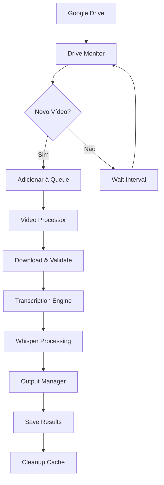

# 🏗️ ARQUITETURA TÉCNICA

## 📋 Visão Geral

O **Video Transcription Agent** utiliza uma arquitetura **event-driven** simples e eficiente, projetada para processar vídeos do Google Drive e gerar arquivos de transcrição automaticamente.

### 🎯 Padrão Arquitetural
- **Event-Driven Processing**
- **Asynchronous Queue System**
- **Modular Component Design**
- **File-Based Output**

---

## 🔧 COMPONENTES PRINCIPAIS

### 1. Drive Monitor Service
**Responsabilidade**: Detectar novos vídeos no Google Drive
```python
# Tecnologias:
- Google Drive API v3
- Webhook notifications
- Polling fallback
- File metadata extraction

# Padrões:
- Observer Pattern
- Retry with exponential backoff
- Rate limiting compliance
```

### 2. Video Processor
**Responsabilidade**: Download, validação e preparação de vídeos
```python
# Tecnologias:
- FFmpeg para conversão
- Async download com aiohttp
- Checksum validation
- Temporary storage management

# Padrões:
- Strategy Pattern (diferentes formatos)
- Chain of Responsibility (validações)
- Factory Pattern (processors)
```

### 3. Transcription Engine
**Responsabilidade**: Interface com Whisper e gerenciamento de modelos
```python
# Tecnologias:
- OpenAI Whisper (local/API)
- GPU acceleration (CUDA)
- Model caching
- Chunk processing

# Padrões:
- Adapter Pattern (Whisper variants)
- Template Method (processing pipeline)
- Singleton (model instances)
```

### 4. Queue System
**Responsabilidade**: Gerenciamento assíncrono de tarefas
```python
# Tecnologias:
- Redis como message broker
- Celery para workers
- Priority queues
- Dead letter queues

# Padrões:
- Producer-Consumer
- Priority Queue
- Circuit Breaker
```

## 📊 FLUXO DE DADOS

### Pipeline Principal


### Estados de Processamento
```python
VIDEO_STATES = {
    'DETECTED': 'Vídeo detectado no Drive',
    'QUEUED': 'Adicionado à fila de processamento',
    'DOWNLOADING': 'Download em progresso',
    'PROCESSING': 'Transcrição em andamento',
    'COMPLETED': 'Processamento concluído',
    'FAILED': 'Erro no processamento',
    'RETRYING': 'Tentativa de reprocessamento'
}
```

## 🗄️ ESTRUTURA DE DADOS

### Database Schema (SQLite/PostgreSQL)
```sql
-- Tabela principal de vídeos
CREATE TABLE videos (
    id UUID PRIMARY KEY,
    drive_file_id VARCHAR(255) UNIQUE NOT NULL,
    filename VARCHAR(500) NOT NULL,
    file_size BIGINT,
    duration_seconds INTEGER,
    status VARCHAR(50) NOT NULL,
    created_at TIMESTAMP DEFAULT NOW(),
    updated_at TIMESTAMP DEFAULT NOW(),
    processed_at TIMESTAMP,
    error_message TEXT,
    retry_count INTEGER DEFAULT 0
);

-- Tabela de transcrições
CREATE TABLE transcriptions (
    id UUID PRIMARY KEY,
    video_id UUID REFERENCES videos(id),
    content TEXT NOT NULL,
    format VARCHAR(20) NOT NULL, -- 'txt', 'srt', 'vtt', 'json'
    language VARCHAR(10),
    confidence_score FLOAT,
    processing_time_seconds INTEGER,
    created_at TIMESTAMP DEFAULT NOW()
);

-- Tabela de configurações
CREATE TABLE settings (
    key VARCHAR(100) PRIMARY KEY,
    value TEXT NOT NULL,
    updated_at TIMESTAMP DEFAULT NOW()
);

-- Índices para performance
CREATE INDEX idx_videos_status ON videos(status);
CREATE INDEX idx_videos_created_at ON videos(created_at);
CREATE INDEX idx_transcriptions_video_id ON transcriptions(video_id);
```

### Cache Structure (Redis)
```python
# Estrutura de cache Redis
CACHE_KEYS = {
    'video_metadata': 'video:meta:{file_id}',
    'processing_status': 'status:{video_id}',
    'download_progress': 'download:{video_id}',
    'transcription_cache': 'transcript:{video_hash}',
    'model_cache': 'whisper:model:{model_name}',
    'rate_limit': 'ratelimit:drive_api:{timestamp}'
}
```

## 🔄 PADRÕES DE DESIGN

### 1. Repository Pattern
```python
class VideoRepository:
    """Abstração para acesso a dados de vídeos"""
    
    async def create(self, video: Video) -> Video:
        pass
    
    async def get_by_id(self, video_id: str) -> Optional[Video]:
        pass
    
    async def get_by_status(self, status: VideoStatus) -> List[Video]:
        pass
    
    async def update_status(self, video_id: str, status: VideoStatus):
        pass
```

### 2. Factory Pattern
```python
class ProcessorFactory:
    """Factory para diferentes tipos de processadores"""
    
    @staticmethod
    def create_processor(file_type: str) -> VideoProcessor:
        processors = {
            'mp4': MP4Processor(),
            'avi': AVIProcessor(),
            'mov': MOVProcessor(),
            'mkv': MKVProcessor()
        }
        return processors.get(file_type, DefaultProcessor())
```

### 3. Observer Pattern
```python
class DriveMonitor:
    """Monitor com padrão Observer para notificações"""
    
    def __init__(self):
        self._observers = []
    
    def attach(self, observer: Observer):
        self._observers.append(observer)
    
    def notify(self, event: DriveEvent):
        for observer in self._observers:
            observer.update(event)
```

## 🚀 ESTRATÉGIAS DE PERFORMANCE

### 1. Processamento Assíncrono
```python
# Configuração de workers Celery
CELERY_CONFIG = {
    'worker_concurrency': 4,  # Baseado em CPU cores
    'task_routes': {
        'transcription.tasks.process_video': {'queue': 'transcription'},
        'download.tasks.fetch_video': {'queue': 'download'},
        'cleanup.tasks.remove_cache': {'queue': 'cleanup'}
    },
    'task_time_limit': 3600,  # 1 hora por vídeo
    'worker_max_tasks_per_child': 10  # Evitar memory leaks
}
```

### 2. Cache Strategy
```python
# Multi-level caching
CACHE_STRATEGY = {
    'L1': 'Memory (LRU Cache)',      # Metadados frequentes
    'L2': 'Redis',                   # Resultados intermediários
    'L3': 'Local Disk',             # Arquivos temporários
    'L4': 'Google Drive',           # Storage permanente
}
```

### 3. Batch Processing
```python
# Processamento em lotes otimizado
BATCH_CONFIG = {
    'max_batch_size': 10,           # Vídeos por lote
    'batch_timeout': 300,           # 5 minutos
    'priority_weights': {
        'small_files': 1.0,         # < 100MB
        'medium_files': 0.7,        # 100MB - 1GB
        'large_files': 0.3          # > 1GB
    }
}
```

## 🔒 SEGURANÇA E COMPLIANCE

### 1. Autenticação e Autorização
```python
# OAuth 2.0 para Google Drive
SECURITY_CONFIG = {
    'oauth_scopes': [
        'https://www.googleapis.com/auth/drive.readonly'
    ],
    'token_refresh_threshold': 300,  # 5 minutos
    'credential_encryption': True,
    'api_key_rotation': True
}
```

### 2. Data Privacy
```python
# Configurações de privacidade
PRIVACY_CONFIG = {
    'local_processing_only': False,  # Usar Whisper local
    'auto_cleanup_cache': True,      # Limpar arquivos temporários
    'encryption_at_rest': True,      # Criptografar cache local
    'audit_logging': True,           # Log de todas as operações
    'data_retention_days': 30        # Retenção de logs
}
```

## 📈 MONITORAMENTO E OBSERVABILIDADE

### 1. Métricas Principais
```python
METRICS = {
    'business': [
        'videos_processed_total',
        'transcription_accuracy_score',
        'processing_time_avg',
        'error_rate_percentage'
    ],
    'technical': [
        'cpu_usage_percent',
        'memory_usage_bytes',
        'disk_usage_bytes',
        'api_calls_per_minute'
    ],
    'operational': [
        'queue_size',
        'worker_active_count',
        'cache_hit_ratio',
        'download_speed_mbps'
    ]
}
```

### 2. Health Checks
```python
# Endpoints de saúde do sistema
HEALTH_CHECKS = {
    '/health/live': 'Liveness probe',
    '/health/ready': 'Readiness probe',
    '/health/drive': 'Google Drive connectivity',
    '/health/whisper': 'Whisper model availability',
    '/health/redis': 'Redis connectivity',
    '/health/database': 'Database connectivity'
}
```

## 🔧 CONFIGURAÇÃO DE AMBIENTE

### Development
```yaml
environment: development
debug: true
log_level: DEBUG
whisper:
  model: tiny  # Modelo rápido para dev
  device: cpu
cache:
  ttl: 300  # 5 minutos
workers: 1
```

### Production
```yaml
environment: production
debug: false
log_level: INFO
whisper:
  model: base  # Balanceamento qualidade/velocidade
  device: cuda  # GPU se disponível
cache:
  ttl: 3600  # 1 hora
workers: 4
```

## 🚀 DEPLOYMENT ARCHITECTURE

### Railway Deployment
```yaml
# railway.toml
[build]
builder = "DOCKERFILE"

[deploy]
healthcheckPath = "/health/ready"
restartPolicyType = "ON_FAILURE"

[env]
PYTHON_VERSION = "3.9"
WHISPER_MODEL = "base"
REDIS_URL = "${{Redis.REDIS_URL}}"
DATABASE_URL = "${{PostgreSQL.DATABASE_URL}}"
```

### Docker Configuration
```dockerfile
# Multi-stage build para otimização
FROM python:3.9-slim as base
# ... configuração base

FROM base as production
# ... configuração de produção
EXPOSE 8000
CMD ["uvicorn", "src.api.main:app", "--host", "0.0.0.0", "--port", "8000"]
```

---

**Esta arquitetura garante escalabilidade, manutenibilidade e performance para processamento de grandes volumes de vídeos.**